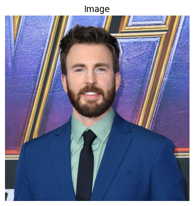
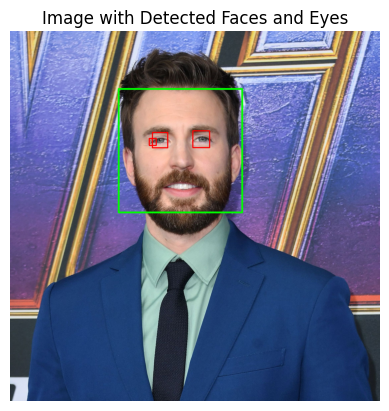

# Face and Eye Detection

## Overview
This project focuses on detecting faces and eyes in images using OpenCV and Haar cascades. It includes functions to detect faces, eyes, and both in an image.

## Prerequisites
- Python 
- OpenCV
- Matplotlib

## Example

1. **Original**

   
   

2. **Face Detection**

   
   

3. **Eyes Detection**

   
   

4. **Face and Eyes Detection**

   
   

