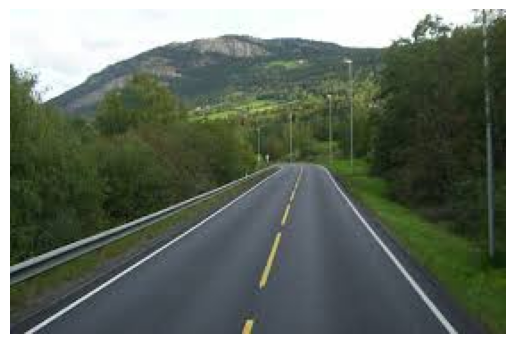
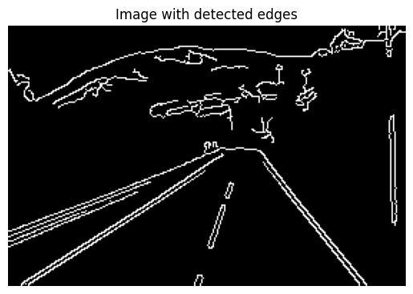
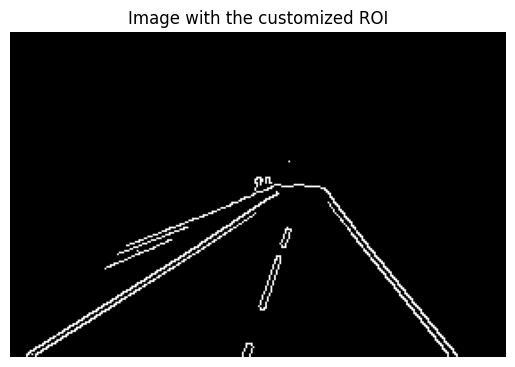
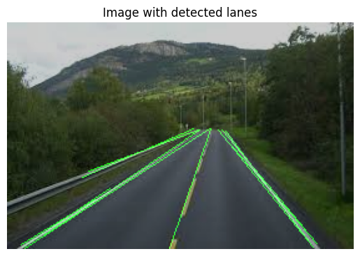

# Lane Detection 

This project implements a lane detection algorithm using computer vision techniques. It detects lanes in images and highlights them, providing a visual representation of the detected lanes on the road.

## Overview

The project performs the following steps:

1. **Image Loading:** The input image is loaded using OpenCV.

2. **Edge Detection:** Edge detection is applied to the grayscale image using the Canny edge detector.

3. **Region of Interest (ROI) Selection:** A specific region of interest is defined in the image, focusing on the area where lanes are expected.

4. **Hough Transform:** The Hough transform is applied to detect lines in the region of interest.

5. **Visualization:** Detected lines are overlaid on the original image to highlight the lanes.

## Prerequisites

- OpenCV
- Matplotlib
- NumPy

## Results

1. **Original Image**

   
   

2. **Detected Edges Image**

   
   

3. **ROI Image**

   
   

4. **Detected Lanes Image**

   
   

## Parameters

Adjustable parameters in the code include:

- Canny edge detection thresholds.
- Region of interest vertices and dimensions.
- Hough transform parameters.

Feel free to experiment with these parameters for different images and scenarios.

