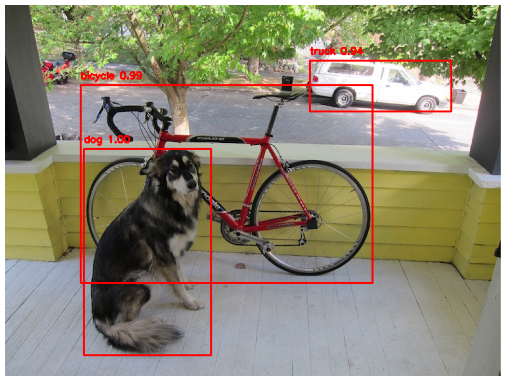
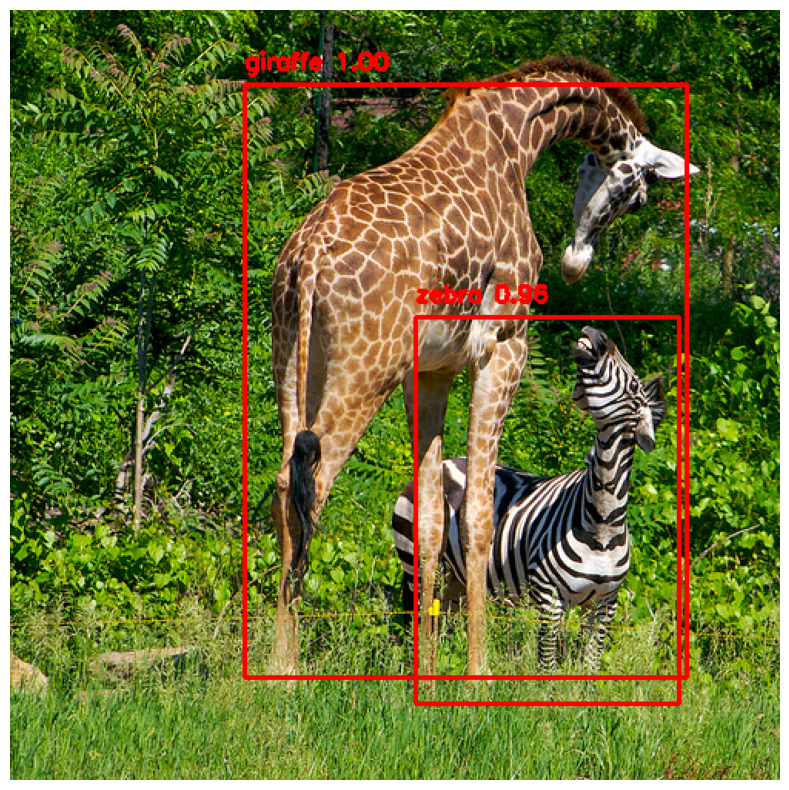
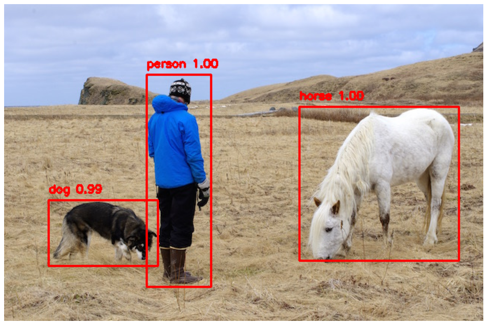
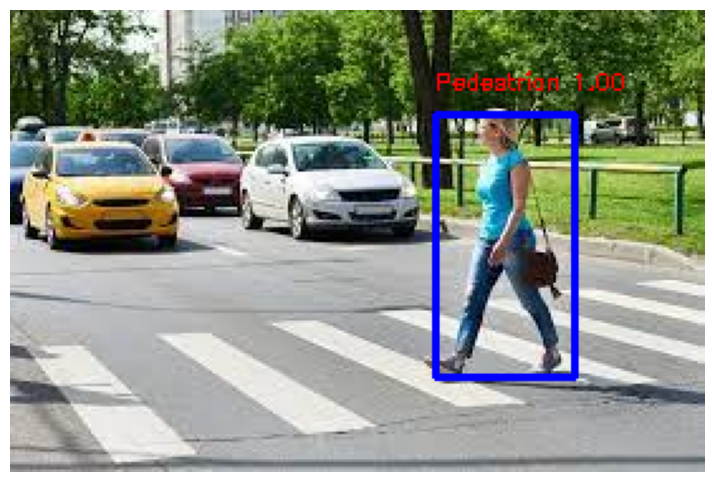

# Object Detection using YOLOv3
This repository contains code for object detection using the YOLOv3 algorithm. YOLOv3 is a popular real-time object detection algorithm known for its speed and accuracy.

## Prerequisites

- Python 3
- OpenCV
- NumPy
- Matplotlib

## Download YOLOv3 Weights and Configuration
To run the object detection, you need to download the YOLOv3 pre-trained weights and configuration files. Run the following commands:

download_url = "https://pjreddie.com/media/files/yolov3.weights"
desired_path = "/content/yolov3.weights"
!wget {download_url} -O {desired_path}

download_url = "https://github.com/pjreddie/darknet/raw/master/cfg/yolov3.cfg"
desired_path = "/content/yolov3.cfg"
!wget {download_url} -O {desired_path}

download_url = "https://github.com/pjreddie/darknet/blob/master/data/coco.names"
desired_path = "/content/coco.names"
!wget {download_url} -O {desired_path}

## Results

   

  

  

  

## Customization
You can modify the confidence threshold and Non-Maximum Suppression (NMS) parameters in the code for different detection sensitivity.
To detect a different specific object, you can change the class_id according to the COCO labels.

